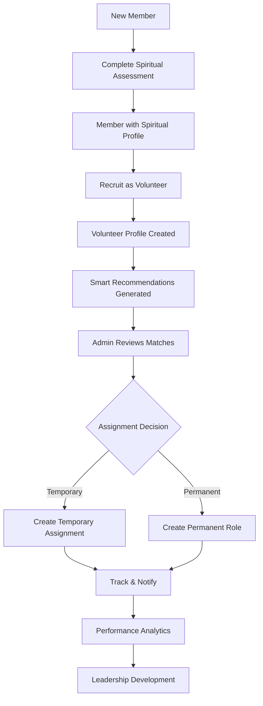

# 📋 VOLUNTEER SYSTEM - COMPLETE WORKFLOW GUIDE
**Khesed-tek Church Management System**  
**Date:** October 22, 2025  
**For:** Church Administrators (Tenants) & Super Admins

---

## 🎯 TABLE OF CONTENTS

1. [System Overview](#system-overview)
2. [Current System Architecture](#current-system-architecture)
3. [Complete Volunteer Lifecycle](#complete-volunteer-lifecycle)
4. [Dashboard Features Explained](#dashboard-features-explained)
5. [Step-by-Step Workflows](#step-by-step-workflows)
6. [Assignment Types (NEW)](#assignment-types-new)
7. [Best Practices](#best-practices)
8. [Troubleshooting](#troubleshooting)

---

## 1. SYSTEM OVERVIEW

### What is the Volunteer System?

The **Volunteer System** is an intelligent platform that helps churches:
- **Recruit** volunteers from church members
- **Match** volunteers to ministries based on spiritual gifts and availability
- **Assign** volunteers to roles (temporary or permanent)
- **Track** volunteer engagement and workload
- **Develop** leaders through structured pathways
- **Automate** scheduling and notifications

### Key Components

```
┌──────────────────────────────────────────────────────────────┐
│                    VOLUNTEER SYSTEM                           │
├──────────────────────────────────────────────────────────────┤
│  Members DB  →  Spiritual Assessment  →  Volunteers Pool     │
│                        ↓                        ↓             │
│              Smart Recommendations  →  Assignments           │
│                        ↓                        ↓             │
│                 Ministry Matching  →  Tracking               │
└──────────────────────────────────────────────────────────────┘
```

---

## 2. CURRENT SYSTEM ARCHITECTURE

### Database Relationships

```
Member (Person in Church)
  ├─ MemberSpiritualProfile (Dones Espirituales)
  │    ├─ Primary Gifts (8 categories)
  │    ├─ Secondary Gifts
  │    ├─ Ministry Passions
  │    ├─ Experience Level (Novato/Intermedio/Avanzado)
  │    ├─ Spiritual Calling (Llamado Espiritual)
  │    └─ Serving Motivation (Motivación para Servir)
  │
  └─ Volunteer (Active Server)
       ├─ Skills
       ├─ Availability Matrix (7 days × 3 time slots)
       ├─ Ministry Assignment (optional)
       ├─ Status (Active/Inactive)
       └─ Assignments[]
            ├─ Temporary Assignments (with dates)
            └─ Permanent Assignments (ongoing)
```

### System Flow



---

## 3. COMPLETE VOLUNTEER LIFECYCLE

### Phase 1: RECRUITMENT (From Member to Volunteer)

**Entry Point:** Members Page → "Dones Espirituales" Tab

**Process:**
1. Member joins church and is added to database
2. Member completes **Spiritual Assessment** (8 categories, mandatory fields)
3. System stores spiritual profile with:
   - Primary gifts (what they excel at)
   - Secondary gifts (supporting abilities)
   - Ministry passions (what excites them)
   - Experience level
   - Spiritual calling
   - Serving motivation

**Result:** Member now has complete spiritual profile

---

### Phase 2: ACTIVATION (Member → Volunteer)

**Entry Point:** Members Page → "Reclutar Voluntario" button

**Process:**
1. Admin selects member from list
2. Fills recruitment form:
   - Skills (specific abilities)
   - Availability (weekly schedule matrix)
   - Ministry preference (optional initial assignment)
3. System creates Volunteer record
4. Volunteer status = **ACTIVE**

**Result:** Member is now an active volunteer in the pool

---

### Phase 3: MATCHING (Smart Recommendations)

**Entry Point:** Voluntarios → "Recomendaciones" Tab

**How It Works:**
The system uses AI-powered matching algorithm:

```javascript
Match Score = (
  Spiritual Gifts Match (40%) +
  Availability Match (30%) +
  Experience Level (20%) +
  Ministry Passion (10%)
)
```

**Example Output:**
```
JUAN PACHANGA - 75% match
├─ Ideal para Ministerio de Alabanza ✓
├─ Disponible fines de semana ✓
└─ Alto potencial de liderazgo ⭐
```

**What Admin Sees:**
- List of volunteers sorted by match percentage
- Ministry recommendations
- Availability indicators
- Leadership potential flags

---

### Phase 4: ASSIGNMENT (Temporary vs Permanent)

#### **4A. TEMPORARY ASSIGNMENTS** ⏱️

**When to Use:**
- Special events (Christmas program, VBS)
- Substitute positions (filling in for absent leader)
- Trial periods (testing volunteer in new role)
- Seasonal ministries (Summer camp)

**Features:**
- ✅ Required: Start date, start time, end time
- ✅ Optional: End date (for multi-day events)
- ✅ Automatic notifications when assignment ends
- ✅ Volunteer can have multiple temporary assignments
- ✅ Does NOT conflict with permanent role

**Example:**
```
Title: "Ayuda en Evento de Navidad"
Type: Temporal
Date: December 24, 2025
Time: 5:00 PM - 9:00 PM
End Date: December 25, 2025 (optional)
```

#### **4B. PERMANENT ASSIGNMENTS** 👑

**When to Use:**
- Core ministry positions (Worship Leader, Youth Pastor)
- Ongoing commitments (Sunday School Teacher)
- Leadership roles (Small Group Coordinator)
- Regular weekly service

**Features:**
- ✅ No date or time required (ongoing)
- ✅ Represents long-term commitment
- ✅ Volunteer can STILL accept temporary assignments
- ✅ Shows as primary role in profile

**Example:**
```
Title: "Líder de Alabanza"
Type: Permanente
Description: "Responsable de liderar equipo de alabanza cada domingo"
```

---

### Phase 5: TRACKING & ANALYTICS

**Entry Point:** Voluntarios → "Analytics" Tab

**Available Dashboards:**

1. **Workload Analytics**
   - Hours served per volunteer
   - Burnout risk indicators
   - Balanced distribution metrics

2. **Recruitment Pipeline**
   - Members with spiritual assessment: X
   - Active volunteers: Y
   - Conversion rate: Z%

3. **Leadership Development**
   - High-potential volunteers
   - Skill progression tracking
   - Leadership pathway recommendations

---

## 4. DASHBOARD FEATURES EXPLAINED

### Tab 1: DASHBOARD 📊
**Purpose:** Overview of entire volunteer system

**Metrics:**
- Total volunteers
- Active assignments
- Upcoming events requiring volunteers
- Recent activity feed

### Tab 2: RECLUTAMIENTO 🎯
**Purpose:** Convert members to volunteers

**Features:**
- Search available members
- View spiritual profiles
- One-click recruitment
- Batch recruitment

### Tab 3: RECOMENDACIONES 💡
**Purpose:** AI-powered volunteer-ministry matching

**Features:**
- Smart matching algorithm (75% match example)
- Ministry fit indicators
- Availability preview
- Leadership potential flags

**Actions:**
- "Asignar Actividad" → Create assignment
- "Ver Perfil" → View full volunteer details

### Tab 4: LIDERAZGO 👥
**Purpose:** Identify and develop leaders

**Features:**
- Leadership scoring
- Growth trajectory visualization
- Training recommendations
- Succession planning

### Tab 5: ONBOARDING 📋
**Purpose:** Structured volunteer onboarding process

**Features:**
- Welcome workflow
- Training checklists
- Mentor assignment
- 30/60/90 day reviews

### Tab 6: MOTOR IA 🤖
**Purpose:** Advanced AI scheduling and optimization

**Features:**
- Auto-schedule volunteers
- Conflict detection
- Load balancing
- Predictive analytics

### Tab 7: ANALYTICS 📈
**Purpose:** Data-driven insights

**Features:**
- Performance dashboards
- Engagement metrics
- Retention analysis
- Custom reports

### Tab 8: GESTIÓN ⚙️
**Purpose:** Administrative settings

**Features:**
- Ministry configuration
- Role templates
- Notification settings
- System preferences

---

## 5. STEP-BY-STEP WORKFLOWS

### WORKFLOW A: Complete New Volunteer Onboarding

**Start:** New member joins church  
**End:** Volunteer assigned to permanent role

```
Step 1: Add Member
  Location: Miembros → Nuevo Miembro
  Fill: Name, contact, demographics
  Result: Member record created

Step 2: Spiritual Assessment
  Location: Miembros → Edit → Evaluación Espiritual
  Fill: 8 category assessment + mandatory fields
  Result: Spiritual profile saved

Step 3: Recruit as Volunteer
  Location: Miembros → Reclutar Voluntario
  Fill: Skills, availability matrix
  Result: Volunteer profile created

Step 4: Review Recommendations
  Location: Voluntarios → Recomendaciones
  Review: Match score and ministry suggestions
  Result: Identify best fit

Step 5: Create Permanent Assignment
  Location: Click "Asignar Actividad"
  Select: Assignment Type = Permanente
  Fill: Title, description
  Result: Volunteer assigned to ministry role

Step 6: Monitor & Develop
  Location: Voluntarios → Analytics
  Track: Engagement, hours, growth
  Result: Ongoing relationship management
```

### WORKFLOW B: Special Event Staffing

**Start:** Christmas program needs 10 volunteers  
**End:** Event fully staffed

```
Step 1: Identify Needs
  Define: Event date, time, required roles
  Example: Dec 24, 5-9 PM, need 5 greeters, 3 tech, 2 childcare

Step 2: Check Availability
  Location: Voluntarios → List
  Filter: Available on Dec 24 evening
  Result: Pool of available volunteers

Step 3: Review Matches
  Location: Voluntarios → Recomendaciones
  Sort: By match score for "Hospitality" ministry
  Result: Top 10 candidates

Step 4: Create Temporary Assignments
  For each volunteer:
    - Click "Asignar Actividad"
    - Type: Temporal
    - Date: Dec 24, 2025
    - Time: 5:00 PM - 9:00 PM
    - Title: "Christmas Program - [Role]"
  Result: 10 assignments created

Step 5: Send Notifications (automatic)
  System sends: Email/SMS confirmations
  Includes: Date, time, role, location
  Result: Volunteers notified

Step 6: Track Completion
  After event: Mark assignments complete
  Result: Hours logged, metrics updated
```

### WORKFLOW C: Permanent Leader Replacement

**Start:** Youth Leader resigning  
**End:** New leader identified and transitioned

```
Step 1: Identify Candidates
  Location: Voluntarios → Liderazgo
  Filter: High leadership score + Youth passion
  Result: 3-5 potential leaders

Step 2: Assign Trial Period (Temporary)
  For top candidate:
    - Type: Temporal
    - Date: 4-week trial (4 Sundays)
    - Title: "Youth Ministry - Assistant Leader (Trial)"
  Result: Candidate in trial role

Step 3: Evaluate Performance
  Location: Voluntarios → Analytics
  Review: Attendance, engagement, feedback
  Result: Decision to promote or continue trial

Step 4: Create Permanent Assignment
  If successful:
    - Type: Permanente
    - Title: "Youth Ministry Leader"
    - Description: Full responsibilities
  Result: New permanent leader assigned

Step 5: Update Original Leader
  Mark old assignment: End date = transition date
  Status: Completed
  Result: Clean transition recorded
```

---

## 6. ASSIGNMENT TYPES (NEW FEATURE)

### Comparison Table

| Feature | Temporary Assignment ⏱️ | Permanent Assignment 👑 |
|---------|------------------------|-------------------------|
| **Use Case** | Events, trials, substitutes | Core roles, leadership |
| **Duration** | Specific dates/times | Ongoing indefinitely |
| **Required Fields** | Title, date, start time, end time | Title only |
| **Optional Fields** | End date, notes | Description, notes |
| **Notifications** | Yes (before & after) | No (ongoing) |
| **Expiration** | Auto-expires after date | Never expires |
| **Quantity** | Unlimited per volunteer | Typically 1-2 per volunteer |
| **Conflicts** | Can overlap if times differ | N/A (always active) |
| **Example** | "VBS Helper - Aug 5-9" | "Worship Leader" |

### Assignment Type Selection

When creating assignment, admin sees:

```
┌─────────────────────────────────────────┐
│  Tipo de Asignación *                   │
├─────────────────────────────────────────┤
│  ⏱️  Temporal                            │
│     Para eventos o días específicos     │
│                                         │
│  👑  Permanente                          │
│     Rol continuo sin fecha final        │
└─────────────────────────────────────────┘
```

### Temporary Assignment Form

```
Title: [Text field]
Description: [Textarea]
Fecha de Inicio: [Date picker] *
Fecha de Finalización: [Date picker] (optional)
Hora de Inicio: [Time picker] *
Hora de Finalización: [Time picker] *
Notas: [Textarea]
```

### Permanent Assignment Form

```
Title: [Text field]
Description: [Textarea]
Notas: [Textarea]

[ℹ️ Info box showing: "Este voluntario será asignado 
de manera continua. No se requiere fecha o horario específico."]
```

---

## 7. BEST PRACTICES

### For Church Administrators (Tenants)

✅ **DO:**
- Complete spiritual assessment for ALL members before recruiting
- Use temporary assignments for trial periods (2-4 weeks)
- Assign permanent roles only after successful trial
- Monitor workload analytics to prevent burnout
- Review recommendations weekly for best matches
- Set up notifications for expiring temporary assignments

❌ **DON'T:**
- Skip spiritual assessment (leads to poor matches)
- Assign permanent roles without trial period
- Over-assign volunteers (check workload first)
- Ignore low match scores (under 50%)
- Forget to update availability when schedules change

### For Super Admins (Platform)

✅ **DO:**
- Educate tenants on complete workflow
- Monitor usage of spiritual assessment feature
- Provide templates for common assignment types
- Review analytics across all churches
- Share best practices from high-performing churches

❌ **DON'T:**
- Allow churches to skip onboarding training
- Ignore low spiritual assessment completion rates
- Let churches operate without understanding workflow

---

## 8. TROUBLESHOOTING

### Issue: "Cannot assign volunteer to role"

**Symptoms:**
- Click "Asignar Actividad" → Alert appears but dialog doesn't open
- No error in console

**Solution:**
✅ **FIXED:** Debug `alert()` calls removed in latest update
- Update: Git push on Oct 22, 2025
- Commit: "Remove debug alerts & Add temporary/permanent assignment support"

**How to verify fix:**
1. Navigate to Voluntarios → Recomendaciones
2. Click "Asignar Actividad"
3. Dialog should open immediately without alert

---

### Issue: "Profile dialog does nothing"

**Symptoms:**
- Click "Ver Perfil" → Alert appears but profile doesn't show

**Solution:**
✅ **FIXED:** Same as above - debug alerts removed

**How to verify fix:**
1. Click "Ver Perfil" on any volunteer
2. Profile dialog should open showing:
   - Spiritual gifts
   - Availability matrix
   - Skills
   - Assignment history

---

### Issue: "Spiritual assessment not saving"

**Symptoms:**
- Fill assessment form → Click save → No toast notification
- Data doesn't persist after page refresh

**Solution:**
✅ **FIXED:** Member Edit page now uses correct API endpoint
- Update: Git push on Oct 22, 2025
- Endpoint: `/api/members/[id]/spiritual-profile`
- Features: Mandatory validation + toast notifications

**How to verify fix:**
1. Miembros → Edit JUAN PACHANGA → Evaluación Espiritual
2. Fill "Llamado Espiritual" and "Motivación para Servir"
3. Click save
4. Should see green toast: "Evaluación espiritual guardada exitosamente"
5. Refresh page → Data persists

---

### Issue: "Mandatory fields showing as optional"

**Symptoms:**
- "Llamado Espiritual (Opcional)" should be mandatory
- "Motivación para Servir (Opcional)" should be mandatory

**Solution:**
✅ **FIXED:** Labels updated to show red asterisk (*)
- Fields now validated on frontend and backend
- Save button disabled until fields filled

---

## 9. GLOSSARY

| Term | Definition | Spanish |
|------|------------|---------|
| **Member** | Person in church database | Miembro |
| **Volunteer** | Active member serving in ministry | Voluntario |
| **Spiritual Assessment** | 8-category gift identification | Evaluación Espiritual |
| **Assignment** | Role or task given to volunteer | Asignación |
| **Temporary Assignment** | Time-bound role (events, trials) | Asignación Temporal |
| **Permanent Assignment** | Ongoing ministry role | Asignación Permanente |
| **Match Score** | AI-calculated fit percentage | Porcentaje de Coincidencia |
| **Recommendation** | System-suggested volunteer-ministry match | Recomendación |
| **Availability Matrix** | 7-day × 3-slot schedule grid | Matriz de Disponibilidad |
| **Leadership Score** | Calculated leadership potential | Puntaje de Liderazgo |
| **Workload** | Hours/commitments per volunteer | Carga de Trabajo |

---

## 10. QUICK REFERENCE CHEAT SHEET

### Common Tasks

| Task | Location | Time |
|------|----------|------|
| Add new member | Miembros → Nuevo Miembro | 2 min |
| Complete spiritual assessment | Edit Member → Evaluación Espiritual | 10 min |
| Recruit volunteer | Miembros → Reclutar Voluntario | 3 min |
| Create temporary assignment | Voluntarios → Asignar Actividad → Temporal | 2 min |
| Create permanent role | Voluntarios → Asignar Actividad → Permanente | 1 min |
| View recommendations | Voluntarios → Recomendaciones | - |
| Check volunteer profile | Voluntarios → Ver Perfil | - |
| Export volunteer list | Voluntarios → Export | 1 min |

### Keyboard Shortcuts

| Action | Shortcut |
|--------|----------|
| Search volunteers | Ctrl + K |
| New assignment | Ctrl + N |
| Save form | Ctrl + S |
| Close dialog | Esc |

---

## 11. SYSTEM UPDATES LOG

### October 22, 2025

**Update 1:** Fixed Assignment Dialog Issue
- **Problem:** Alert blocking dialog from opening
- **Solution:** Removed debug `alert()` calls
- **Impact:** "Asignar Actividad" and "Ver Perfil" now work correctly

**Update 2:** Added Temporary vs Permanent Assignments
- **Feature:** New assignment type selector
- **Options:** Temporal (with dates) or Permanente (ongoing)
- **Validation:** Conditional required fields based on type

**Update 3:** Unified Spiritual Assessment API
- **Problem:** Member Edit using old endpoint without validation
- **Solution:** Updated to use `/api/members/[id]/spiritual-profile`
- **Impact:** Toast notifications + mandatory field validation

**Update 4:** Removed Old Spiritual Gifts Dialog
- **Problem:** Dones Espirituales showing outdated card UI
- **Solution:** Redirect to dedicated assessment page
- **Impact:** Consistent experience across all entry points

---

## 12. SUPPORT & TRAINING

### For Tenants (Church Admins)

**Training Videos:**
- Module 1: System Overview (15 min)
- Module 2: Spiritual Assessment (20 min)
- Module 3: Recruitment Process (10 min)
- Module 4: Assignment Creation (15 min)
- Module 5: Analytics & Reports (10 min)

**Documentation:**
- User Manual (this document)
- Video Tutorials (YouTube playlist)
- FAQ (Frequently Asked Questions)

### For Super Admins

**Platform Management:**
- Church onboarding checklist
- Tenant training materials
- System monitoring dashboard
- Performance benchmarks

---

## CONCLUSION

The **Volunteer System** transforms church volunteer management from manual chaos to intelligent automation. By following this workflow:

1. ✅ Every member gets spiritual assessment
2. ✅ Smart AI recommendations match gifts to ministries
3. ✅ Flexible assignments (temporary + permanent) support all scenarios
4. ✅ Analytics prevent burnout and optimize engagement
5. ✅ Leadership development creates sustainable growth

**Next Steps:**
1. Review this document with your leadership team
2. Complete spiritual assessments for existing members
3. Recruit first batch of volunteers
4. Create trial assignments (temporary)
5. Monitor analytics and adjust

**Questions?** Contact support or refer to FAQ section.

---

**Document Version:** 1.0  
**Last Updated:** October 22, 2025  
**Author:** AI Development Team  
**For:** Khesed-tek Church Management System
